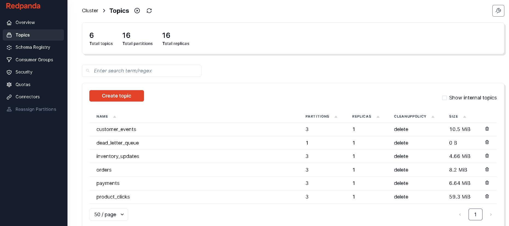
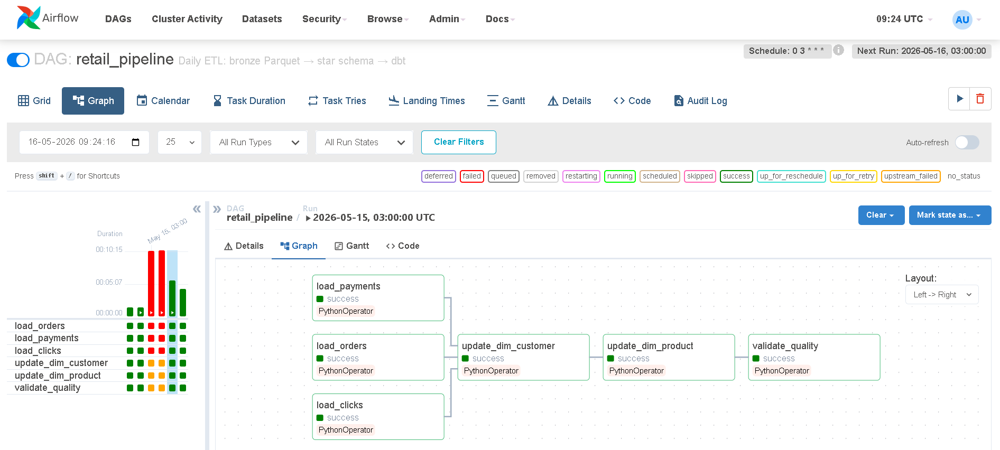
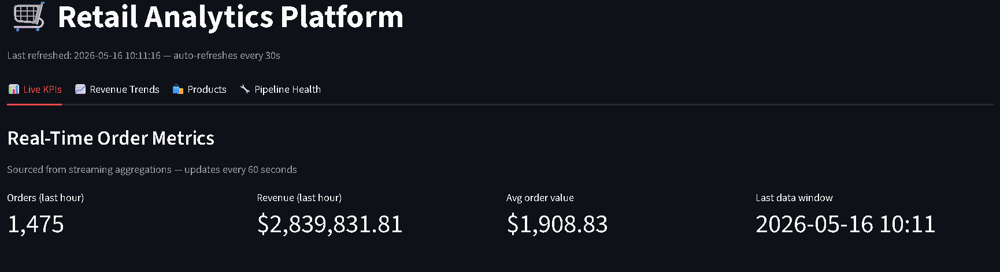
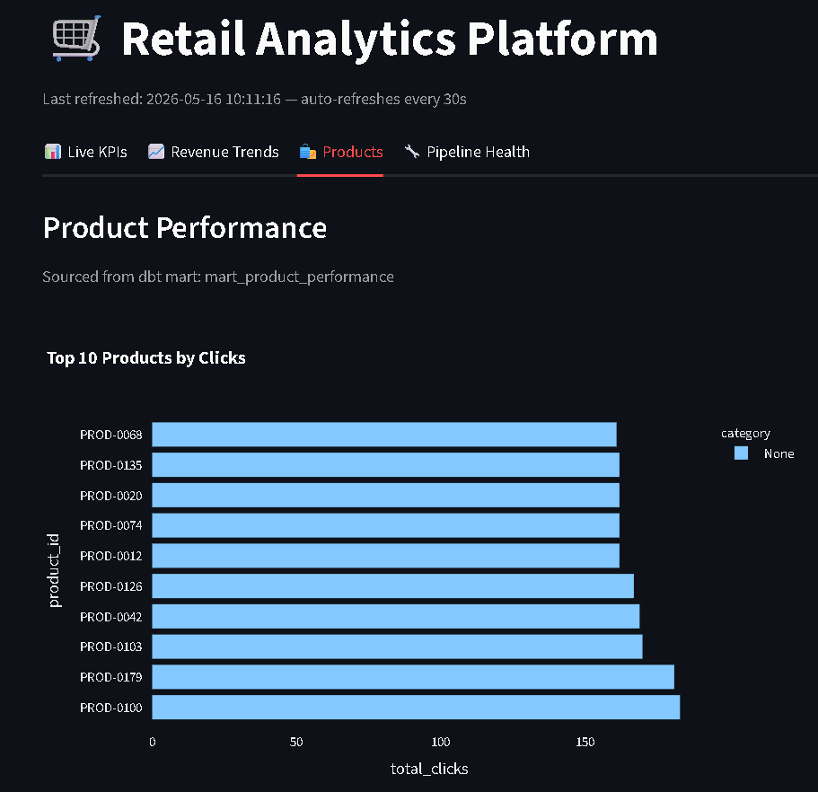
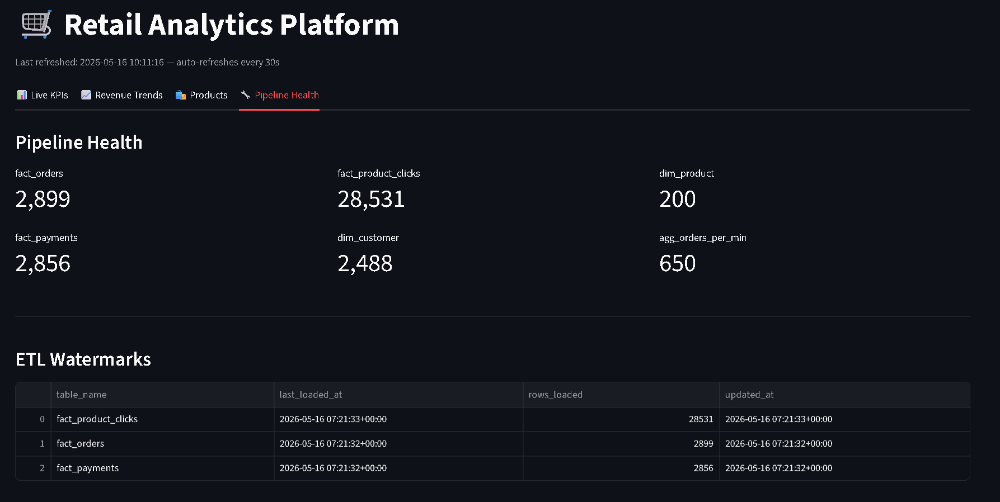
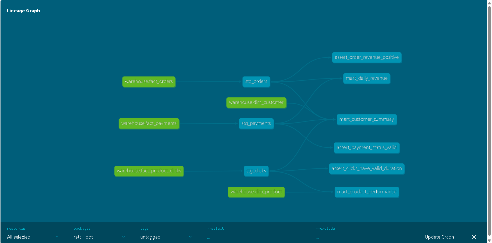

# 🛒 Real-Time Retail Analytics Pipeline

[](https://github.com/shubhamtiw17/retail-analytics-pipeline/actions/workflows/ci.yml)


A production-grade, end-to-end streaming analytics platform that ingests
e-commerce events in real time, processes them through a multi-layer
lakehouse architecture, and serves live KPI dashboards — built to mirror
how data platforms at Amazon, Shopify, and Uber handle operational data
at scale.

---

## What this project demonstrates

This project was built to prove mastery of the full data engineering stack
that mid-to-senior DE roles require in 2026:

| Skill | Implementation |
|---|---|
| **Streaming ingestion** | PySpark Structured Streaming consuming 5 Kafka topics simultaneously |
| **Event-driven architecture** | Kafka with 3 partitions/topic, dead letter queue, consumer groups |
| **Data lake design** | Bronze layer in MinIO (S3-compatible), Parquet partitioned by date |
| **Orchestration** | Airflow DAG with task dependencies, retries, SLA tracking, watermarks |
| **Warehouse modelling** | Star schema — 3 fact tables, 4 dim tables, ETL watermark tracking |
| **Transformation layer** | dbt staging views + mart tables, 19 tests, lineage graph |
| **Data quality** | Custom SQL assertions, orphan record detection, pipeline run logging |
| **Containerisation** | Full stack in Docker Compose — 11 services, one command to start |
| **CI/CD** | GitHub Actions running lint, unit tests, dbt run + test on every push |
| **API design** | FastAPI with 8 endpoints, Swagger docs, pagination, filtering |
| **Documentation** | 12 architecture decisions, 6-scenario runbook, performance benchmarks |

---

## Architecture

```
┌─────────────────────────────────────────────────────────────┐
│                    EVENT GENERATION                         │
│  Python Faker · 5 event types · weighted volume · 50 TPS   │
│  Flash sale scenario: 500 TPS for 30 seconds               │
└──────────────────────────┬──────────────────────────────────┘
                           ↓
┌─────────────────────────────────────────────────────────────┐
│                    APACHE KAFKA                             │
│  6 topics · 3 partitions each · auto-offset management     │
│  orders · payments · customer_events ·                     │
│  inventory_updates · product_clicks · dead_letter_queue    │
└──────────────────────────┬──────────────────────────────────┘
                           ↓
┌─────────────────────────────────────────────────────────────┐
│              PYSPARK STRUCTURED STREAMING                   │
│  Micro-batch · 30s trigger · exactly-once checkpointing    │
│  Schema validation → valid events → MinIO bronze           │
│                    → invalid events → DLQ topic            │
│  Window aggregations → PostgreSQL every 60s                │
└──────┬───────────────────────────────────────┬─────────────┘
       ↓                                       ↓
┌──────────────┐                    ┌─────────────────────────┐
│  MinIO / S3  │                    │      PostgreSQL          │
│  Bronze layer│                    │  agg_orders_per_minute  │
│  Parquet     │                    │  agg_top_products       │
│  date partns │                    └─────────────────────────┘
└──────┬───────┘
       ↓
┌─────────────────────────────────────────────────────────────┐
│                   APACHE AIRFLOW                            │
│  Daily DAG · incremental load · watermark tracking         │
│  load_orders → load_payments → load_clicks                 │
│       → update_dim_customer → update_dim_product           │
│       → validate_quality                                   │
└──────────────────────────┬──────────────────────────────────┘
                           ↓
┌─────────────────────────────────────────────────────────────┐
│                  POSTGRESQL WAREHOUSE                       │
│  Star schema · fact_orders · fact_payments                 │
│  fact_product_clicks · dim_customer · dim_product          │
│  dim_date · etl_watermarks · pipeline_runs                 │
└──────────────────────────┬──────────────────────────────────┘
                           ↓
┌─────────────────────────────────────────────────────────────┐
│                   DBT TRANSFORMATIONS                       │
│  Staging views: stg_orders · stg_payments · stg_clicks     │
│  Mart tables: mart_daily_revenue · mart_product_performance│
│               mart_customer_summary                        │
│  19 tests · custom SQL assertions · lineage graph          │
└──────────────────────────┬──────────────────────────────────┘
                           ↓
┌──────────────────────────┬──────────────────────────────────┐
│   STREAMLIT DASHBOARD    │        FASTAPI                   │
│   4 tabs · Plotly charts │  8 endpoints · Swagger docs      │
│   30s auto-refresh       │  pagination · filtering          │
└──────────────────────────┴──────────────────────────────────┘
```

---

## Tech Stack

| Layer | Technology | Version | Why chosen |
|---|---|---|---|
| Ingestion | Apache Kafka | 7.5.0 | Industry standard for high-throughput event streaming |
| Streaming | PySpark Structured Streaming | 3.5.1 | Exactly-once semantics, micro-batch, native Kafka integration |
| Storage | MinIO (S3-compatible) | latest | Local S3 replacement, same API as production AWS S3 |
| Format | Apache Parquet | — | Columnar, compressed, partitionable, warehouse-ready |
| Orchestration | Apache Airflow | 2.8.1 | De facto standard, DAG dependencies, retry logic, SLAs |
| Warehouse | PostgreSQL | 15 | Star schema, ACID, excellent dbt support |
| Transform | dbt-core + dbt-postgres | 1.7.0 | SQL-first, version-controlled, lineage, built-in testing |
| Quality | dbt tests + custom SQL | — | Schema tests + business logic assertions |
| Dashboard | Streamlit + Plotly | 1.32.0 | Python-native, version controlled, no license needed |
| API | FastAPI + uvicorn | 0.110.0 | Async, auto Swagger docs, type-safe |
| Infra | Docker Compose | — | Full local stack, one command, reproducible |
| CI/CD | GitHub Actions | — | Lint + unit tests + dbt run/test on every push |

---

## Screenshots

### Kafka — 6 topics with live message flow


### MinIO — Bronze layer Parquet files partitioned by date


### Airflow — ETL DAG all green


### Dashboard — Live KPIs


### Dashboard — Product Performance


### Dashboard — Pipeline Health


### dbt — Lineage Graph


---

## Performance benchmarks

Measured on Dell laptop, Windows 10, 16GB RAM, Docker Desktop:

| Metric | Value | Notes |
|---|---|---|
| Generator throughput | 50 events/sec | 500/sec during flash sale scenario |
| Kafka topics | 6 topics · 3 partitions each | orders, payments, clicks, inventory, customer, DLQ |
| Spark micro-batch interval | 30 seconds | balances latency vs file size |
| Avg batch processing time | ~8 seconds per topic | 5 topics running in parallel |
| End-to-end latency (event → MinIO) | ~38 seconds | generator → Kafka → Spark → local → MinIO |
| Airflow DAG runtime | ~45 seconds | full load of all fact + dim tables |
| dbt run time | 1.5 seconds | 6 models including 3 mart tables |
| dbt test time | 1.75 seconds | 19 tests, 0 failures |
| PostgreSQL mart query time | <50ms | pre-aggregated mart tables |
| Dashboard refresh interval | 30 seconds | `@st.cache_data(ttl=30)` |

---

## Quick Start

**Prerequisites:** Docker Desktop, Python 3.10+, Git, winutils (Windows only)

```bash
# 1. Clone
git clone https://github.com/shubhamtiw17/retail-analytics-pipeline
cd retail-analytics-pipeline

# 2. Environment
cp .env.example .env

# 3. Start all Docker services (first run pulls images — ~5 mins)
docker-compose up -d

# 4. Verify all services healthy
docker-compose ps

# 5. Install Python dependencies
pip install -r requirements.txt

# 6. Create warehouse schema
docker exec -i postgres psql -U retail -d retail_warehouse < warehouse/init/01_streaming_tables.sql
docker exec -i postgres psql -U retail -d retail_warehouse < warehouse/init/02_star_schema.sql
python warehouse/populate_dim_date.py

# 7. Start event generator (Terminal 1)
python generators/event_generator.py --broker localhost:9092 --tps 50

# 8. Start streaming ingest (Terminal 2 — Windows: set HADOOP_HOME=C:\hadoop first)
python spark/jobs/stream_ingest.py

# 9. Start aggregations (Terminal 3)
python spark/jobs/stream_aggregations.py

# 10. Trigger Airflow DAG
# Open http://localhost:8080 → retail_pipeline → Trigger

# 11. Run dbt
cd dbt/retail_dbt && dbt run && dbt test

# 12. Start dashboard (Terminal 4)
streamlit run dashboard/app.py

# 13. Start API (Terminal 5)
uvicorn api.main:app --reload --port 8000
```

---

## Service URLs

| Service | URL | Credentials |
|---|---|---|
| Kafka UI | http://localhost:8085 | — |
| MinIO Console | http://localhost:9001 | admin / password123 |
| Spark Master UI | http://localhost:8081 | — |
| Airflow | http://localhost:8080 | admin / admin |
| Streamlit Dashboard | http://localhost:8501 | — |
| FastAPI Swagger | http://localhost:8000/docs | — |

---

## Project Structure

```
retail-analytics-pipeline/
├── generators/
│   └── event_generator.py      # Produces 5 event types to Kafka
├── config/
│   ├── settings.py             # Centralised config, path helpers
│   └── schemas.py              # PySpark schemas for all event types
├── spark/jobs/
│   ├── stream_ingest.py        # Kafka → Parquet → MinIO (bronze)
│   └── stream_aggregations.py  # Kafka → window KPIs → PostgreSQL
├── airflow/dags/
│   └── retail_pipeline.py      # Daily ETL DAG (6 tasks)
├── warehouse/
│   ├── init/
│   │   ├── 01_streaming_tables.sql  # Aggregation + pipeline tables
│   │   └── 02_star_schema.sql       # Star schema DDL
│   └── populate_dim_date.py    # Seeds dim_date 2024–2027
├── dbt/retail_dbt/
│   ├── models/staging/         # Thin cleaning views
│   ├── models/marts/           # KPI tables for dashboard
│   └── tests/                  # Custom SQL assertions
├── dashboard/
│   └── app.py                  # Streamlit 4-tab dashboard
├── api/
│   └── main.py                 # FastAPI 8 endpoints
├── tests/
│   └── test_event_generator.py # 7 unit tests
├── docs/
│   ├── DECISIONS.md            # 12 architecture decisions
│   └── RUNBOOK.md              # 6 failure scenarios + benchmarks
├── .github/workflows/
│   └── ci.yml                  # Lint + tests + dbt on every push
└── docker-compose.yml          # 11 services, full local stack
```

---

## Data Model

### Fact tables
| Table | Grain | Key columns |
|---|---|---|
| `fact_orders` | One row per order | order_id, customer_id, total_amount, region |
| `fact_payments` | One row per payment attempt | payment_id, order_id, amount, status |
| `fact_product_clicks` | One row per click event | click_id, product_id, duration_ms, referrer |

### Dimension tables
| Table | Description |
|---|---|
| `dim_customer` | Customer profile, preferred device, first/last seen |
| `dim_product` | Product engagement stats, category |
| `dim_date` | Date spine 2024–2027, year/month/quarter/weekend |

### dbt Mart tables
| Mart | Business question answered |
|---|---|
| `mart_daily_revenue` | How much revenue per region per day? Payment success rate? |
| `mart_product_performance` | Which products get the most clicks? From which channels? |
| `mart_customer_summary` | Who are our best customers? LTV segmentation? |

---

## Event Types

| Topic | Schema | Volume | Sample use case |
|---|---|---|---|
| `orders` | order_id, items[], total_amount, region | 1x | Revenue tracking |
| `payments` | payment_id, method, status, gateway_ref | 1x | Conversion funnel |
| `customer_events` | signup/login/logout/profile_update | 2x | Retention analysis |
| `inventory_updates` | product_id, warehouse, delta, reason | 1x | Stock alerts |
| `product_clicks` | product_id, referrer, device, duration_ms | 10x | Recommendation engine |

---

## Design Decisions

See [docs/DECISIONS.md](./docs/DECISIONS.md) for 12 documented decisions:

- Why MinIO over real AWS S3
- Why 3 Kafka partitions (not 1, not 10)
- Why micro-batch over continuous streaming
- Why separate ingest and aggregation Spark jobs
- Why local staging over S3A connector (Windows-specific)
- Why no FK constraints on fact tables
- Why dbt hybrid materialization (views + tables)
- Why Streamlit over Power BI/Tableau
- ...and 4 more

---

## Operations

See [docs/RUNBOOK.md](./docs/RUNBOOK.md) for:

- Full stack startup procedure (13 steps)
- Kafka consumer lag spike — diagnosis + fix
- DLQ events accumulating — inspection + replay
- Spark checkpoint corruption — recovery without data loss
- Airflow DAG failures — common causes + fixes
- dbt model failure — rollback procedure
- MinIO disk full — cleanup steps
- Performance benchmark table
- Healthcheck command reference

---

## CI/CD

Every push to `main` triggers two GitHub Actions jobs:

**lint-and-test:** flake8 linting → pytest unit tests → docker-compose syntax validation

**dbt-validation:** spins up PostgreSQL → creates schema → `dbt debug` → `dbt run` → `dbt test`

---

## Project Status

- [x] Phase 1 — Infrastructure, Kafka, event generator
- [x] Phase 2 — PySpark structured streaming, MinIO bronze layer
- [x] Phase 3 — Star schema, Airflow ETL DAG
- [x] Phase 4 — dbt models, 19 tests, lineage docs
- [x] Phase 5 — Streamlit dashboard, FastAPI
- [x] Phase 6 — DECISIONS.md, RUNBOOK.md, benchmarks, CI/CD